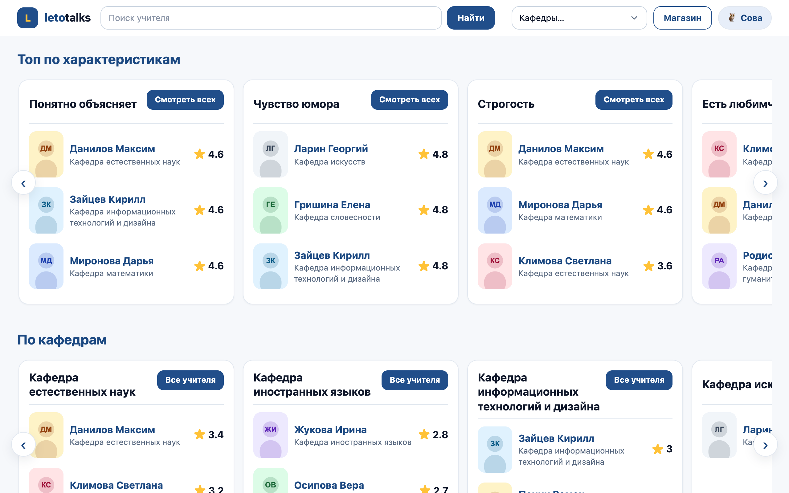
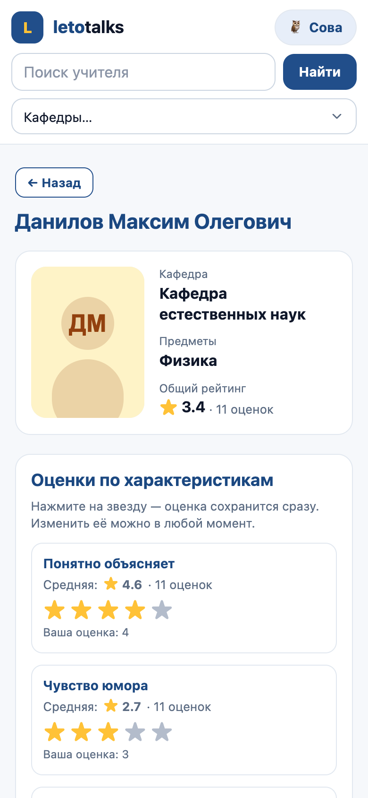
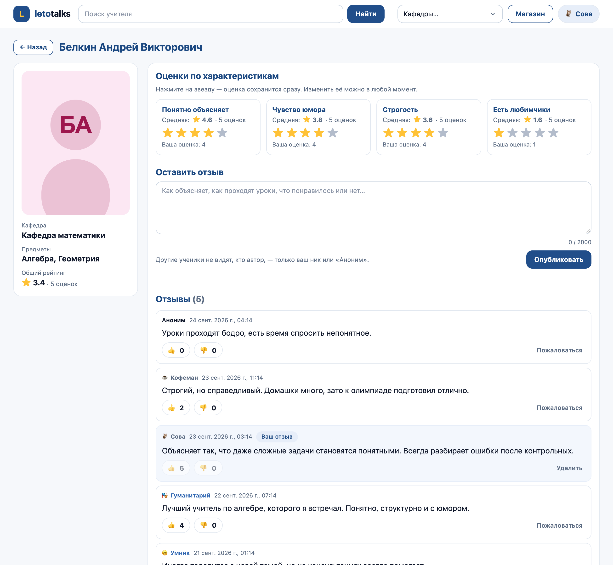
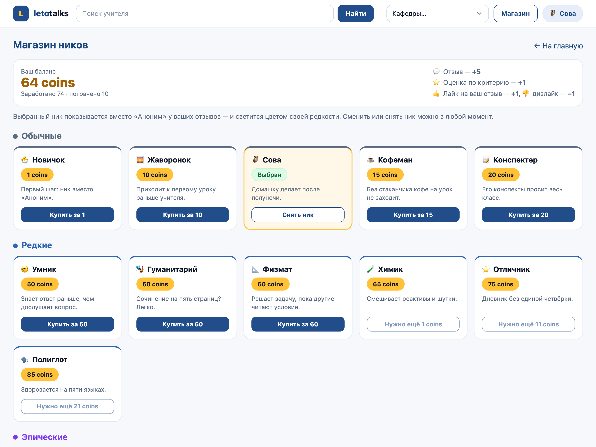
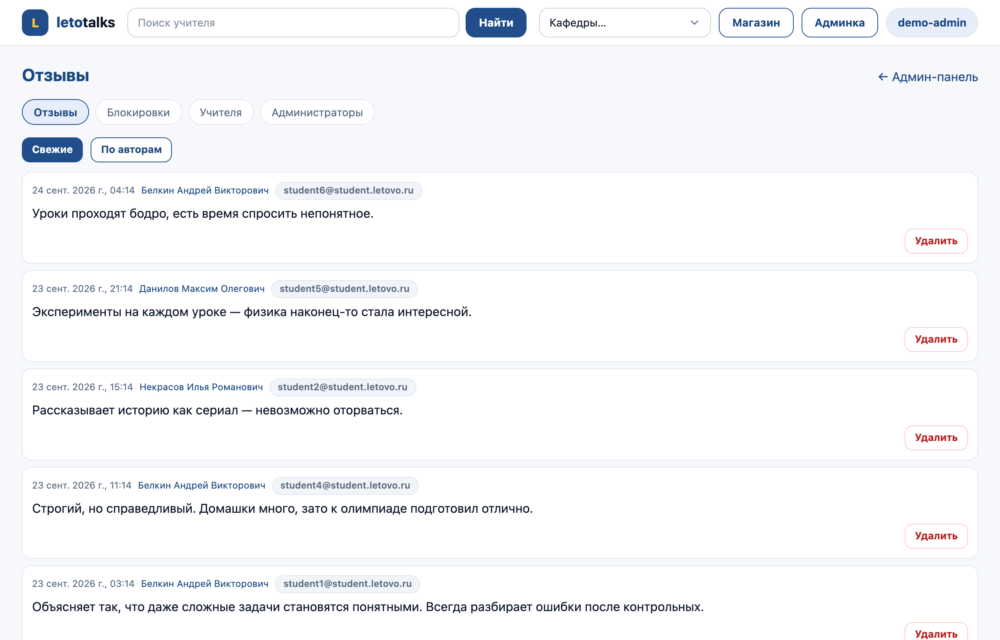
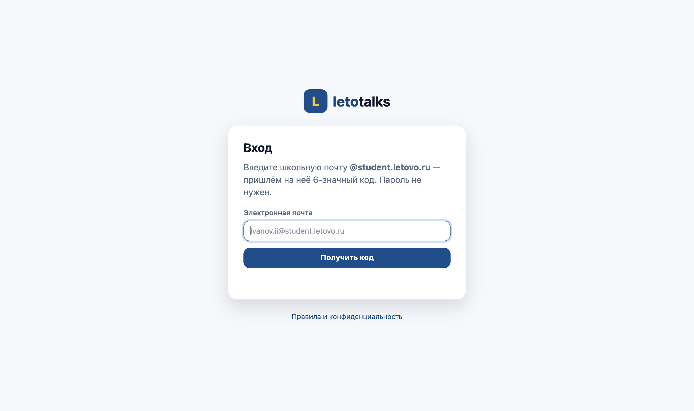
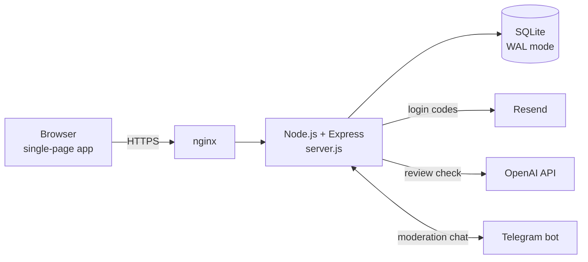
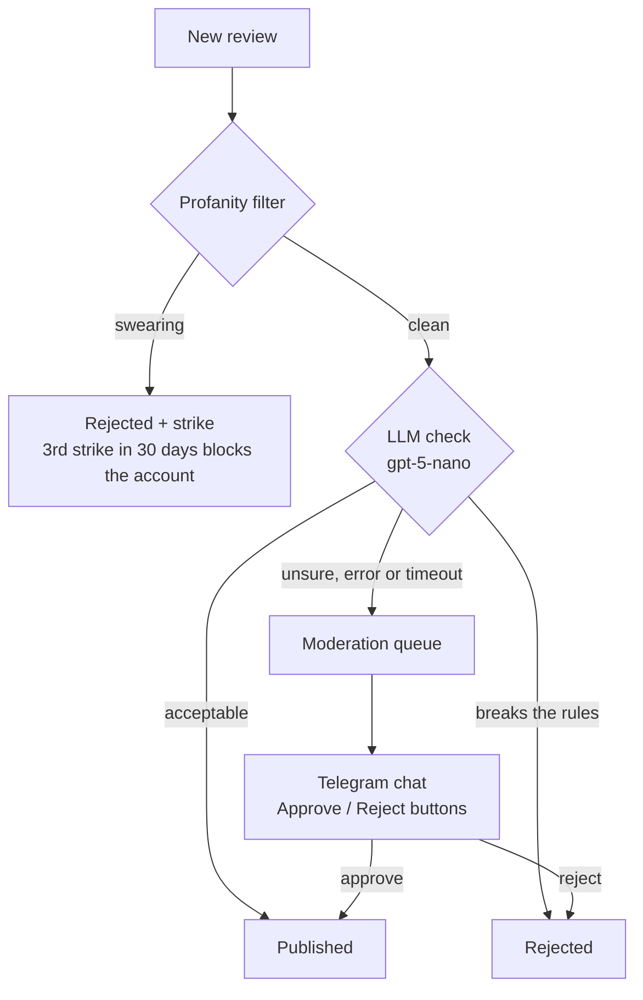

# LetoTalks

[](https://github.com/NikichVP/letotalks/actions/workflows/ci.yml)

LetoTalks is a web platform where students of Letovo School rate their teachers and share anonymous reviews. A team of students built it, and it runs in production for the school community. Only school email addresses can sign in.

> [!NOTE]
> This is an independent student project. It is not affiliated with or endorsed by Letovo School. The repository contains no real teacher or student data. The screenshots and the demo use fictional data. The interface and the code comments are in Russian.



## Features



- **School-only sign-in.** Students sign in with a one-time code sent to their school email. Visitors who are not signed in see only the login screen.
- **Teacher catalog.** The home page has carousels of top teachers for each characteristic and each department. There are also department pages and a name search that works in any word order.
- **Ratings.** Students give each teacher 1–5 stars on four characteristics: explains clearly, sense of humour, strictness, and "has favourites". A rating saves on click and can be changed at any time.
- **Anonymous reviews.** Other students see only the author's nickname or «Аноним». Reviews can be liked, disliked and reported.
- **Moderation.** Every review goes through a profanity filter and an LLM check. Unclear cases go to moderators in Telegram ([details below](#review-moderation)).
- **Coins and a nickname shop.** Students earn coins: +5 for a review, +1 for each rating, and ±1 for each like or dislike their reviews get. Coins buy nicknames in four rarity tiers, and a nickname shows next to the student's reviews in its tier's colour.
- **Admin panel.** Admins can see recent reviews and reviews by author, ban users, and manage teachers (including photo upload). The root admin manages other admins.
- **Mobile-friendly** layout.

<br clear="right">

<table>
  <tr>
    <th width="50%">Teacher page</th>
    <th width="50%">Nickname shop</th>
  </tr>
  <tr>
    <td></td>
    <td></td>
  </tr>
  <tr>
    <th>Admin panel</th>
    <th>Sign-in</th>
  </tr>
  <tr>
    <td></td>
    <td></td>
  </tr>
</table>

## Architecture



- **Server.** A single Express 5 process serves the API and the static frontend.
- **Database.** SQLite through `better-sqlite3` in WAL mode. The schema and versioned migrations are created in code.
- **Frontend.** Plain HTML, CSS and JavaScript with a hash router. There is no build step.
- **Production.** nginx terminates TLS in front of the app. Calls to OpenAI, Telegram and Resend can go through an HTTP(S) proxy (`OUTBOUND_PROXY_URL`). Production uses this proxy because those services are blocked from the hosting network.

### Review moderation



The server and the browser share one profanity filter (`public/profanity.js`). Before sending a review, the browser warns about exactly what the server would reject. The LLM receives the review inside tags as data, not as instructions, and must answer with a single digit. Any other answer, an error or a timeout sends the review to manual review. The moderation queue is stored in the database, so it survives restarts.

## Security and privacy

- **Login codes.** Six-digit one-time codes come from a CSPRNG. Each code is valid for 10 minutes and allows 5 attempts, and at most 3 codes per email can be active at once. Per-email and per-IP throttling is designed so that nobody can lock another student out.
- **Sessions.** The session token is random and lives in an `HttpOnly`, `SameSite=Lax` cookie, which is `Secure` in production. The server stores only its SHA-256 hash. A session lasts 14 days. Each user can have one active session, bound to their browser.
- **Access.** The API and teacher photos require a signed-in session.
- **Rate limits.** Limits apply per user, because the whole school reaches the internet through one NAT address. A per-IP ceiling applies on top.
- **Input and uploads.** All user content is escaped when rendered. Helmet sets a strict Content-Security-Policy. Uploaded photos are checked by file signature and size.
- **Anonymity.** Review authors are hidden from other students. Only moderators can see them.
- **Operations.** In production the moderation endpoint must be HTTPS on a public host. Email-provider errors are logged without addresses. Daily database backups keep 7 copies, readable by the owner only.
- **Secrets.** Secrets live in `.env`, which is never committed.

## Running locally

You need Node.js 20 or newer.

```bash
git clone https://github.com/NikichVP/letotalks.git
cd letotalks
npm install
npm run demo
```

Open <http://localhost:3001>. Sign in as `demo-admin@student.letovo.ru` to get the admin panel, or as any `student1`…`student14@student.letovo.ru`. The demo sends no email: the one-time code is printed in the terminal.

The demo uses a separate database (`.demo/`) with 12 fictional teachers and reviews, and it connects to no external service. A local stub approves new reviews in place of the LLM check. The profanity filter still runs.

To run with your own configuration:

```bash
cp .env.example .env   # every option is documented in the file
npm start
```

A new database starts empty. Set `ROOT_ADMIN_EMAIL` and add teachers in the admin panel. Without `RESEND_API_KEY`, sign-in codes are printed to the console (development mode only).

Tests and lint run in CI on every push:

```bash
npm test
npm run lint
```

## Project structure

```text
server.js              HTTP API: auth and sessions, catalog, reviews, ratings, shop, admin, Telegram webhook
db_processing.js       SQLite schema, versioned migrations, data access
comment_moderation.js  review moderation: profanity filter + LLM check
shop_items.js          nickname catalog: rarity, price, description
outbound_proxy.js      optional outbound HTTP(S) proxy for OpenAI, Telegram and Resend
migrate.js             creates or upgrades the database schema (npm run migrate)
public/                frontend: index.html, app.js, styles.css, profanity.js
scripts/               local demo: demo.js, seed-demo.js
tests/                 node:test suites
docs/screenshots/      images for this README (fictional demo data)
```

## Team

| Contributor | Main contributions |
| --- | --- |
| [@NikichVP](https://github.com/NikichVP) | Project lead: first prototype, backend and API, caching, email sign-in, LLM moderation, Telegram integration, shop, deployment |
| [@BeaverProg](https://github.com/BeaverProg) | Request cache, teacher loading and page updates, concurrent session handling |
| [@cortexgod](https://github.com/cortexgod) | Migration from CSV files to SQLite, teacher directory data, shop pricing |
| [@leenakwa](https://github.com/leenakwa) | Toxicity checks and reporting, client-side moderation flow, Telegram fixes, environment configuration |
| [@lizakatul](https://github.com/lizakatul) | Visual design, top bar layout |

## License

No open-source license has been chosen yet. The code is published for reference, and all rights remain with the contributors.
